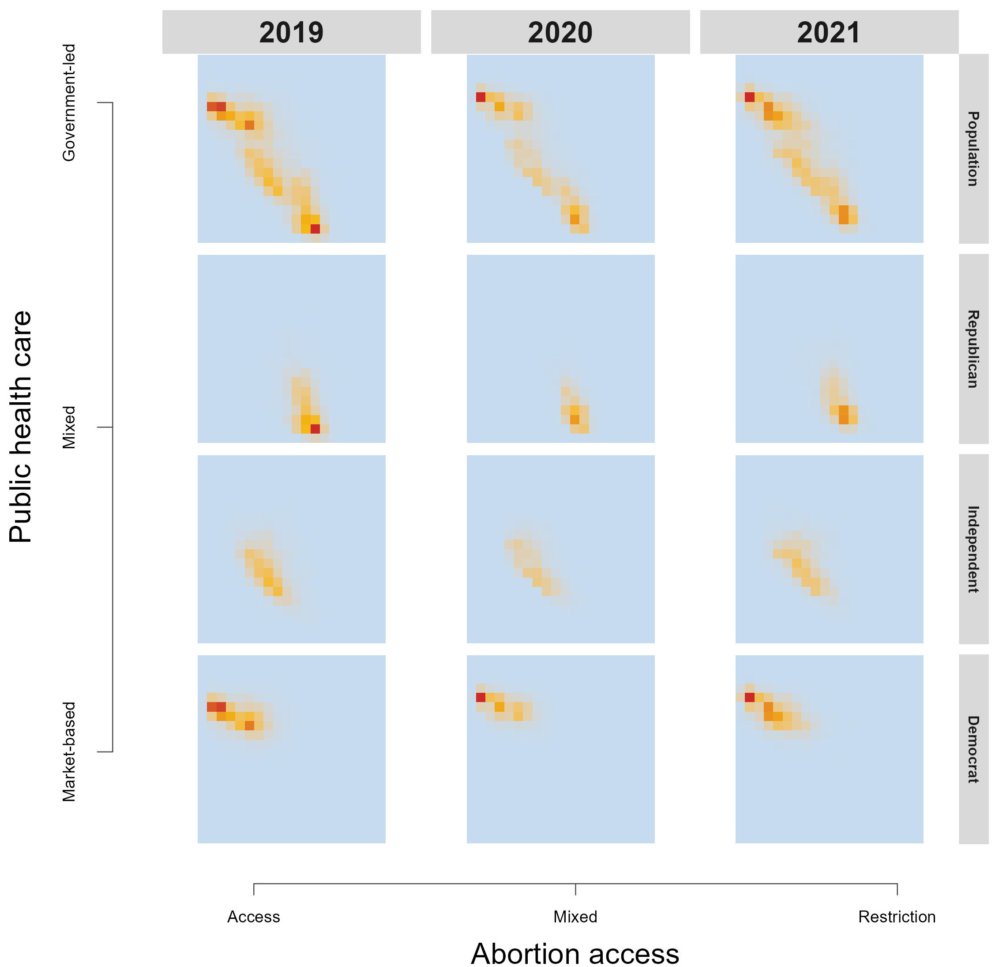
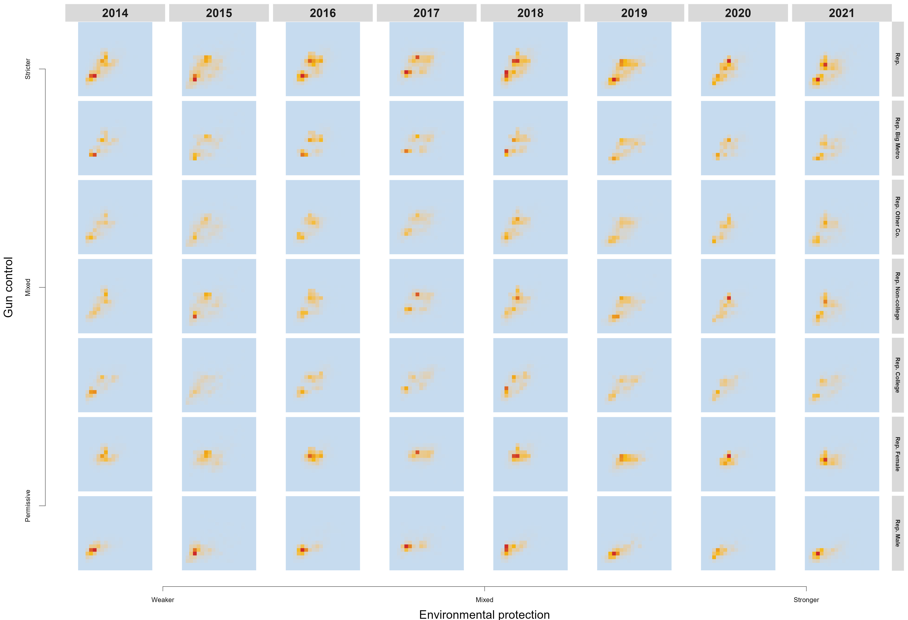

# Multidimensional Visualization of Large-Scale Survey Data

## 1. Overview

This study introduces a multidimensional visualization framework for analyzing complex structures in survey-based policy preferences. Conventional analyses typically focus on individual policy issues, providing valuable insights into specific dimensions of public opinion but offering limited perspectives on how multiple attitudes interact within respondents. To address this gap, we propose a two-dimensional heatmap approach that integrates model-predicted policy scores to account for demographic and interaction effects. This model-based visualization highlights joint patterns of policy preferences and enables interpretable exploration of multidimensional relationships in survey data. We apply the framework to national survey responses from 2014 to 2021 to illustrate how it can reveal evolving associations among key policy domains and identify systematic subgroup differences. Beyond this application, the proposed method provides a general and scalable tool for dissecting high-dimensional survey data, offering new possibilities for studying interconnected attitudes and behavioral patterns across diverse research contexts.

This repository contains the R code, processed data, and visualization scripts for the project.

---

## 2. How to Run the Project

### Install and load the package

Install the package directly from GitHub:

```r
devtools::install_github("yu-jingtian/surveyMDV")
library(surveyMDV)
```

This installs the package along with its required dependencies (e.g., ggplot2, dplyr).

### Load packaged data (2014–2021)

The package ships with respondent-level policy score datasets covering survey years 2014–2021:

- `policy_rf`: random-forest estimated policy scores
- `policy_xgb`: XGB estimated policy scores
- `policy_lm`: linear-model estimated policy scores
- `policy_svr`: support-vector-regression estimated policy scores
- `policy_raw`: raw policy scores normalized to the `[0, 1]` interval
- `demographics`: respondent demographics and survey weights

The model-estimated datasets contain policy scores with model suffixes such as `_rf`, `_xgb`, `_lm`, and `_svr`. The raw-score dataset uses the base policy names directly, such as `immig`, `enviro`, `guns`, and `healthcare`. Each dataset includes the keys `case_id` and `year`, which can be used for merging.

You can load the full datasets directly:

```r
data("policy_rf", package = "surveyMDV")
data("policy_xgb", package = "surveyMDV")
data("policy_lm", package = "surveyMDV")
data("policy_svr", package = "surveyMDV")
data("policy_raw", package = "surveyMDV")
data("demographics", package = "surveyMDV")
```

Or use the provided helper functions to subset by year and/or select columns:

```r
rf_2016 <- get_policy_predicted(
  model = "rf",
  year = 2016,
  cols = c("immig_rf", "guns_rf")
)

demo_2016 <- get_demographics(
  year = 2016,
  cols = c("partisan", "race", "gender", "weight_cumulative")
)

raw_2016 <- get_policy_raw(
  year = 2016,
  cols = c("immig", "guns")
)
```

Datasets are designed to be joined using case_id and year:

```r
library(dplyr)

demo_all <- get_demographics()

df <- get_policy_predicted(model = "rf") |>
  inner_join(demo_all, by = c("case_id", "year"))
```

This merged table can be used directly for visualization, subgroup analysis, or model-based summaries as described in the paper.

### Example: main visualization styles

Most plotting functions use model-estimated policy scores. Supported models are `"rf"`, `"xgb"`, `"lm"`, and `"svr"`. Policy names can be provided as base names, such as `"immig"`, `"trade"`, `"healthcare"`, or `"abortion"`; the selected model suffix is resolved internally.

```r
# 1) Single estimation-based heatmap with marginal distributions
p1 <- plot_policy_heat_single(
  year = 2019,
  policy_x = "immig",
  policy_y = "trade",
  model = "rf",
  group = "population"
)

p1
```

```r
# 2) Raw 2D score map with discrete marginal distributions
# The central panel is a frequency scatter map:
# point size and color represent the empirical joint proportion.
p2 <- plot_policy_raw_single(
  year = 2020,
  policy_x = "enviro",
  policy_y = "guns"
)

p2
```

```r
# 3) One-year heatmap row: Population / Republican / Independent / Democrat
p3 <- plot_policy_heatrow_year(
  year = 2021,
  policy_x = "healthcare",
  policy_y = "abortion",
  model = "rf"
)

p3
```

```r
# 4) Multi-year partisan decomposition of the population
p4 <- plot_policy_partisan_grid(
  years = 2019:2021,
  policy_x = "abortion",
  policy_y = "healthcare",
  model = "rf"
)

p4
```

```r
# 5) Multi-year subgroup analysis for the population or one partisan group
p5 <- plot_policy_subgroup_grid(
  years = 2014:2021,
  policy_x = "enviro",
  policy_y = "guns",
  model = "rf",
  group = "republican"
)

p5
```

```r
# 6) Single policy heatmap with a color-vision-accessible palette
p6 <- plot_policy_heat_single(
  year = 2019,
  policy_x = "immig",
  policy_y = "trade",
  model = "rf",
  group = "population",
  palette = "accessible"
)

p6
```

---

## 3. Project Highlights

Below are examples of visualization outputs:

<table>
  <tr>
    <td>
      
    </td>
    <td>
      <b>Partisan Decomposition.</b> Multi-year decomposition of the population distribution by political affiliation. The panels show how the joint policy structure differs across Population, Republican, Independent, and Democrat respondents over time.
    </td>
  </tr>
  <tr>
    <td>
      
    </td>
    <td>
      <b>Subgroup Analysis.</b> Multi-year subgroup breakdown within a selected group. This view highlights how geography, education, and gender explain within-group heterogeneity in the joint policy preference distribution.
    </td>
  </tr>
</table>

---

## 4. Data Sources
- **Public Political Preference Survey Dataset** Cumulative CES Policy Preferences (2014-2021):  
  [https://doi.org/10.7910/DVN/OSXDQO](https://doi.org/10.7910/DVN/OSXDQO)
- **Corresponding Demographic Survey** Cumulative CES Common Content:  
  [https://doi.org/10.7910/DVN/II2DB6](https://doi.org/10.7910/DVN/II2DB6)
- **Geographical Information**  2023 Rural-Urban Continuum Codes (RUCC):
  [https://www.ers.usda.gov/data-products/rural-urban-continuum-codes/](https://www.ers.usda.gov/data-products/rural-urban-continuum-codes/)
